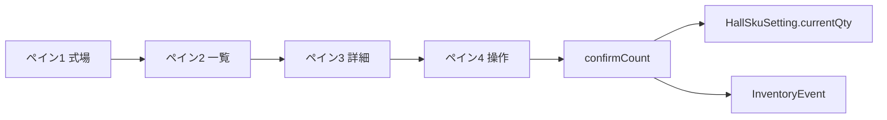

# 備品管理（4ペイン）要件・決定一覧

> グリル（要件深掘り）で合意した内容の整理。実装仕様書ではなく、**意思決定の索引**として使う。
>
> 最終更新: 2026-06-02

---

## このドキュメントを最新に保つ方法

1. **仕様を変える前に grill-me で1問ずつ決める**（推奨案つきで）
2. **決まったらこのファイルの該当 § を書き換える**（コードより先、または同時）
3. **末尾の [変更履歴](#変更履歴) に日付・要約を1行追記**
4. **実装済みかどうかは [§13 実装状況](#13-実装状況) で区別する**（決定 ≠ 実装済み）

> 2026-06-02 の §7 差し替えは、旧「ロケーション別入出庫」モデルから **現数入力→自動発注** への方針転換。個体管理（§4〜§6）は従来どおり。

---

## 目次

1. [プロダクトの骨格](#1-プロダクトの骨格)
2. [ペイン役割](#2-ペイン役割)
3. [権限](#3-権限)
4. [個体（シリアル追跡）](#4-個体シリアル追跡)
5. [在庫外（個体）](#5-在庫外個体)
6. [行先マスタ](#6-行先マスタ)
7. [SKU：現数入力と自動発注](#7-sku現数入力と自動発注)
8. [InventoryEvent（履歴）](#8-inventoryevent履歴)
9. [棚卸し](#9-棚卸し)
10. [一覧・アラート](#10-一覧アラート)
11. [v1で入れない／後回し](#11-v1で入れない後回し)
12. [未決・実装時に詰める細部](#12-未決実装時に詰める細部)
13. [実装状況](#13-実装状況)
14. [データフロー概要](#14-データフロー概要)

---

## 1. プロダクトの骨格

| 項目 | 決定 |
|------|------|
| UI構造 | **4ペイン**（式場 → 一覧 → 詳細 → 操作）。左→右で全体→詳細 |
| 技術 | **Next.js × shadcn/ui**（Prisma + SQLite は4ヶ月目第一歩としてローカル実装中） |
| 追跡モデル | **個体管理とSKUが混在** |
| SKUの日常操作 | **棚の現数を入力 → 自動発注**（+/- による入出庫ではない） |
| 個体の日常操作 | **QRスキャン**（読み取り → サーバが個体を一意判定） |
| 接続 | **v1はオンライン必須** |
| 同時更新 | **楽観ロック**（`HallSkuSetting.version`）、衝突時は再読込 |
| 履歴 | **InventoryEvent に一本化・追記のみ**（取消は `CANCEL` イベント） |
| 権限 | **役割分割**（現場 / 管理） |

---

## 2. ペイン役割

| ペイン | 役割 | 主な機能 |
|--------|------|----------|
| 1 式場選択 | 「どこ」の管理か | 自社ホール一覧 |
| 2 備品リスト | 「なに」があるか | 選択式場の SKU ＋ 個体一覧、定数未満フィルタ |
| 3 備品詳細 | 「状態」を確認 | **SKU**: 現数・定数・発注中・不足分。**個体**: シリアル・在庫外・返却予定等 |
| 4 操作 | 「アクション」 | **SKU**: 現数グリッド → 確認モーダル → 確定。**個体**: QRスキャン（返却・在庫外） |

---

## 3. 権限

### 管理ロール

- 廃棄、履歴の取消、マスタ変更
- **定数（parLevel）の設定・変更**（式場×SKU）
- 行先マスタ・カテゴリの登録/更新
- **QRの発行・再発行**
- 在庫外理由のうち管理限定分（式場間・廃棄予定など）
- **全社ビュー**（返却超過一覧・定数未満一覧）
- 発注の **入庫確定**（`RECEIVE` イベント）— v1 UI は後回し可

### 現場ロール

- 在庫外（理由ホワイトリスト、[§5](#5-在庫外個体)参照）
- **返却はスキャンで確定**
- **SKUの現数入力・発注トリガー**（ペイン4グリッド）
- **既印刷ラベルの紐付けスキャン**（QR発行は不可）

---

## 4. 個体（シリアル追跡）

| 項目 | 決定 |
|------|------|
| 分類の主軸 | **カテゴリ別ルール**（例: 演台=個体、消耗品=SKU） |
| ルール管理 | **全社カテゴリデフォルト** ＋ **品目だけ例外**（管理・理由必須・履歴） |
| 追跡方式の変更 | **原則不可**（新規登録＋旧無効化） |
| 新規品目 | **カテゴリ必須** |
| 棚卸し | **全個体スキャン** ＋ 差分 |
| ラベル導入 | **棚卸しの波**で貼付・紐付け（未ラベルは差分で可視） |
| 棚卸し矛盾 | **例外キュー**（確定前に解消 or 差分として残す） |

### QR・セキュリティ

| 項目 | 決定 |
|------|------|
| QRの中身 | **ランダムUUID等の内部ID**（URL・シリアル直書きなし） |
| 照会API | **ログイン必須**（未認証は詳細を返さない） |
| スキャン手段 | **スマホブラウザ ＋ 画面内カメラ** |
| 再発行 | **旧IDは即無効**、イベントを履歴に残す |
| 発行権限 | **管理のみ** ／ 現場は紐付けスキャンのみ |
| 物理ラベル | **短称 ＋ ID一部**（式場名・フルIDは載せない） |
| 紐付けフロー | **事前印刷 → 未紐付けQRスキャン → 個体紐付け** |
| 画面QR | **印刷専用**（画面スキャンでの運用はしない） |
| 1Dバーコード | **v1非対応**（新QRラベルへ置換） |
| 悪用対策 | **レート制限 ＋ 連続失敗ロック** |
| 端末 | **個人持ち**（共有端末の使い回しなし） |
| セッション | **長めセッション** ＋ **高リスク操作のみ再認証** |

---

## 5. 在庫外（個体）

| 項目 | 決定 |
|------|------|
| 状態 | **「在庫外」に束ねる** ＋ **理由は固定リストのみ**（メモ任意） |
| 現場が付けられる理由 | **場内移動・客先貸出・修理預け** |
| 管理限定の例 | **式場間恒久移動・廃棄予定** など |
| 返却 | **現場がスキャンで在庫に戻す** |
| 行先 | **理由に応じて必須**（[§6](#6-行先マスタ)のマスタ選択） |

### 返却予定日・アラート

| 理由 | 予定日 | アラート |
|------|--------|----------|
| 客先貸出 | **必須** | 予定日**翌日**から超過 |
| 修理預け | **必須** | 同上 |
| 場内移動 | **欄なし** | **なし** |
| 式場間（管理） | **任意・推奨** | 客先・修理と同様の必須にはしない |

- 予定日の変更: **現場可**（履歴に追記）
- 超過一覧: **選択式場に連動** ＋ **管理は全社ビュー**
- 日付計算: **年中無休**

---

## 6. 行先マスタ

| 項目 | 決定 |
|------|------|
| 入力 | **マスタから選択** ＋ **「その他」はメモ必須** |
| 構造 | **種別付き統合マスタ**（`hall` / `vendor` / `customer`） |
| 登録・更新 | **管理ロールのみ** |
| 式場 | **ペイン1のホール一覧と同一ソース** |
| 用途 | **個体の在庫外のみ**（SKU発注とは別） |

---

## 7. SKU：現数入力と自動発注

> **2026-06-02 差し替え** — 旧モデル（式場×ロケーション×数量、+/- 入出庫）は v1 から外す。

| 項目 | 決定 |
|------|------|
| マスタ | **全社共通 SKU**（品名・単位・カテゴリ） |
| 定数 | **式場×SKU ごと**に `parLevel`（目標在庫数。例: 短寸線香20箱） |
| 現数 | **式場×SKU ごと**に `currentQty`（棚に今ある数） |
| 発注中 | `InventoryEvent` の `ORDER`（`status=REQUESTED`）の合計 |
| 日常操作 | ペイン4で **現数をワンタップ入力** → 確認モーダル → 確定 |
| グリッド上限 | **0 〜 max(parLevel, 20)**（定数連動） |
| 発注数の計算 | `max(0, 定数 − 現数 − 発注中合計)` |
| 確定時の在庫更新 | **現数で currentQty を上書き**（楽観ロック） |
| 発注数 ≥ 1 | `InventoryEvent(type=ORDER, status=REQUESTED)` を追記 |
| 発注数 = 0 | **`InventoryEvent(type=COUNT)` のみ**（OrderEvent は作らない） |
| 数量 | **整数のみ**、**マイナス不可** |
| 在庫外 | **SKUには使わない** |
| 定数の編集 | **管理のみ** |
| カテゴリ | **管理が初期登録** |

### 確認モーダル（必須）

数字タップ後、Server Action 実行前に確認する。

- 発注あり: 「現数 **N** を記録 → **M個** 発注します」
- 発注なし: 「現数 **N** を記録します（発注不要）」

---

## 8. InventoryEvent（履歴）

| 項目 | 決定 |
|------|------|
| 方針 | **履歴は InventoryEvent に一本化**（追記のみ） |
| `COUNT` | 現数記録（発注0のとき） |
| `ORDER` | 発注（`orderedQty`, `status=REQUESTED`） |
| `RECEIVE` | 入庫確定（発注中 → 在庫反映）— v1 UI 後回し可 |
| `CANCEL` | 発注取消 |
| 記録項目 | `hallId`, `skuId`, `countedQty`, `parLevel`（確定時点）, `orderedQty`（ORDER 時）, `createdAt` |

---

## 9. 棚卸し

| 対象 | 方法 |
|------|------|
| 個体 | **全スキャン** ＋ 差分 |
| SKU | **現数入力フローと同型**（棚ごとに COUNT イベント）— 詳細は未詰め |
| セッション | **明示セッション**・下書き保存・再開（後回し） |

---

## 10. 一覧・アラート

| 一覧 | 現場 | 管理 |
|------|------|------|
| 返却予定日超過（個体） | 選択式場 | ＋ 全社 |
| 定数未満（SKU） | 選択式場 | ＋ 全社 |
| 発注中あり（SKU） | ペイン2・3で表示 | ＋ 全社 |

---

## 11. v1で入れない／後回し

- オフライン照会・同期
- **ロケーション別 SKU 在庫・式場内 SKU 移動**（旧 §7 モデル）
- SKU の +/- クイック変更・数量調整モーダル
- 1Dバーコード読取
- 画面QRでの日常スキャン（SKU）
- 認証・ログイン
- 入庫確定 UI（`RECEIVE` はスキーマのみ）
- 祝日・営業日カレンダー
- （任意）メール等のプッシュ通知

---

## 12. 未決・実装時に詰める細部

- [ ] 高リスク**再認証**の方式（パスワード / PIN）
- [ ] ラベル**印刷手段**（PDF / ラベルプリンタ）
- [ ] 本番 DB（Vercel 向け Postgres 等への移行）
- [ ] **カテゴリ初期リスト**の具体名
- [ ] 個体データの Prisma 化タイミング

---

## 13. 実装状況

| 領域 | 状態 | 備考 |
|------|------|------|
| 4ペイン UI | ✅ | `supplies-main-mockup.tsx` |
| 個体 | 🔶 モック | 静的データ、QR は UI のみ |
| SKU 現数グリッド | ✅ | ペイン4 |
| SKU 詳細（現数/定数/発注中） | ✅ | ペイン3 |
| Prisma + SQLite | ✅ | ローカルのみ |
| `confirmCount` Server Action | ✅ | 楽観ロック付き |
| InventoryEvent | ✅ | COUNT / ORDER |
| RECEIVE / CANCEL UI | ❌ | スキーマのみ |
| 認証 | ❌ | |
| Vercel 本番での永続化 | ❌ | SQLite はサーバーレス非対応 |

---

## 14. データフロー概要

### 責務の切り分け

| ドメイン | 主な操作 |
|----------|----------|
| 個体 | QRスキャン、在庫外・返却、履歴 |
| SKU | 現数入力、自動発注、InventoryEvent |
| 管理 | 定数設定、QR発行、入庫確定、マスタ |

---

## 変更履歴

| 日付 | 内容 |
|------|------|
| 2026-05-20 | グリル合意内容を初版作成（ロケーション別 SKU モデル） |
| 2026-06-02 | §7 を現数入力→自動発注に差し替え。InventoryEvent 一本化。§13 実装状況追加 |
