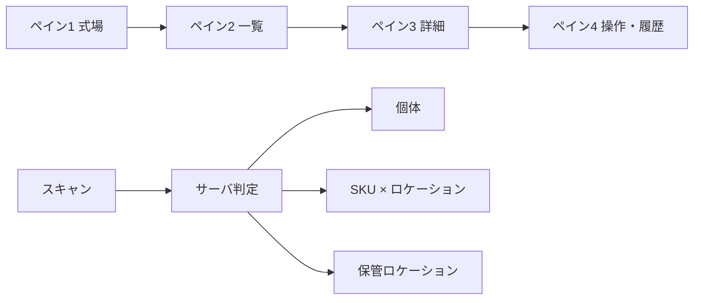

# 備品管理（4ペイン）要件・決定一覧

> グリル（要件深掘り）で合意した内容の整理。実装仕様書ではなく、**意思決定の索引**として使う。
>
> 最終更新: 2026-05-20

---

## 目次

1. [プロダクトの骨格](#1-プロダクトの骨格)
2. [ペイン役割](#2-ペイン役割)
3. [権限](#3-権限)
4. [個体（シリアル追跡）](#4-個体シリアル追跡)
5. [在庫外（個体）](#5-在庫外個体)
6. [行先マスタ](#6-行先マスタ)
7. [SKU在庫](#7-sku在庫)
8. [棚卸し](#8-棚卸し)
9. [一覧・アラート](#9-一覧アラート)
10. [v1で入れない／後回し](#10-v1で入れない後回し)
11. [未決・実装時に詰める細部](#11-未決実装時に詰める細部)
12. [データフロー概要](#12-データフロー概要)

---

## 1. プロダクトの骨格

| 項目 | 決定 |
|------|------|
| UI構造 | **4ペイン**（式場 → 一覧 → 詳細 → 操作・履歴）。左→右で全体→詳細 |
| 技術 | **Next.js × shadcn/ui** |
| 追跡モデル | **個体管理とSKU在庫が混在** |
| スキャン | **読み取り → サーバが個体 / SKU / ロケーションを一意判定** |
| 接続 | **v1はオンライン必須** |
| 同時更新 | **楽観ロック**、衝突時は再読込 |
| 履歴 | **追記のみ**（誤りは**取消 / 訂正イベント**で残す） |
| 権限 | **役割分割**（現場 / 管理） |

---

## 2. ペイン役割

| ペイン | 役割 | 主な機能 |
|--------|------|----------|
| 1 式場選択 | 「どこ」の管理か | 自社ホール一覧（A館・B館など） |
| 2 備品リスト | 「なに」があるか | 選択式場に紐づく備品一覧 |
| 3 備品詳細 | 「状態」を確認 | 画像・シリアル・購入日・メンテ等 |
| 4 操作・履歴 | 「アクション」 | QR発行/表示、移動・修理・廃棄、直近履歴 |

---

## 3. 権限

### 管理ロール

- 廃棄、履歴の取消、マスタ変更
- **式場間の恒久移動**（所有の切替）
- 行先マスタ・保管ロケーション・カテゴリの登録/更新
- SKU初回在庫・数量調整（棚卸し外）・SKU廃棄（数量）
- **QRの発行・再発行**
- 在庫外理由のうち管理限定分（式場間・廃棄予定など）
- **全社ビュー**（返却超過一覧・SKU不足一覧）

### 現場ロール

- 在庫外（理由ホワイトリスト、[§5](#5-在庫外個体)参照）
- **返却はスキャンで確定**
- 式場内SKU移動（出元・入先ロケーションスキャン）
- 入出庫（ロケーション → SKU選択 → 数量）
- **既印刷ラベルの紐付けスキャン**（QR発行は不可）

---

## 4. 個体（シリアル追跡）

| 項目 | 決定 |
|------|------|
| 分類の主軸 | **カテゴリ別ルール**（例: 演台=個体、コード類=SKU） |
| ルール管理 | **全社カテゴリデフォルト** ＋ **品目だけ例外**（管理・理由必須・履歴） |
| 追跡方式の変更 | **原則不可**（新規登録＋旧無効化） |
| 新規品目 | **カテゴリ必須** |
| 棚卸し | **全個体スキャン** ＋ 差分 |
| ラベル導入 | **棚卸しの波**で貼付・紐付け（未ラベルは差分で可視） |
| 棚卸し矛盾 | **例外キュー**（確定前に解消 or 差分として残す） |

### QR・セキュリティ

| 項目 | 決定 |
|------|------|
| QRの中身 | **ランダムUUID等の内部ID**（URL・シリアル直書きなし） |
| 照会API | **ログイン必須**（未認証は詳細を返さない） |
| スキャン手段 | **スマホブラウザ ＋ 画面内カメラ** |
| 再発行 | **旧IDは即無効**、イベントを履歴に残す |
| 発行権限 | **管理のみ** ／ 現場は紐付けスキャンのみ |
| 物理ラベル | **短称 ＋ ID一部**（式場名・フルIDは載せない） |
| 紐付けフロー | **事前印刷 → 未紐付けQRスキャン → 個体紐付け** |
| 画面QR | **印刷専用**（画面スキャンでの運用はしない） |
| 1Dバーコード | **v1非対応**（新QRラベルへ置換） |
| 悪用対策 | **レート制限 ＋ 連続失敗ロック** |
| 端末 | **個人持ち**（共有端末の使い回しなし） |
| セッション | **長めセッション** ＋ **高リスク操作のみ再認証** |

---

## 5. 在庫外（個体）

| 項目 | 決定 |
|------|------|
| 状態 | **「在庫外」に束ねる** ＋ **理由は固定リストのみ**（メモ任意） |
| 現場が付けられる理由 | **場内移動・客先貸出・修理預け** |
| 管理限定の例 | **式場間恒久移動・廃棄予定** など |
| 返却 | **現場がスキャンで在庫に戻す** |
| 行先 | **理由に応じて必須**（[§6](#6-行先マスタ)のマスタ選択） |

### 返却予定日・アラート

| 理由 | 予定日 | アラート |
|------|--------|----------|
| 客先貸出 | **必須**（空欄 → カレンダーで必ず選択） | 予定日**翌日**から超過 |
| 修理預け | **必須**（同上） | 同上 |
| 場内移動 | **欄なし** | **なし**（完全チェック対象外） |
| 式場間（管理） | **任意・推奨** | 客先・修理と同様の必須にはしない |

- 予定日の変更: **現場可**（**予定日変更イベント**を履歴に追記）
- 超過一覧: **選択式場に連動** ＋ **管理は全社ビュー**
- 超過一覧の操作: 行タップで **ペイン3（詳細）** へ（返却・予定日変更はそこで）
- 日付計算: **年中無休** → 営業日・祝日の除外はしない

---

## 6. 行先マスタ

| 項目 | 決定 |
|------|------|
| 入力 | **マスタから選択** ＋ **「その他」はメモ必須** |
| 構造 | **種別付き統合マスタ**（`hall` / `vendor` / `customer`）、理由タグで候補を絞る |
| 登録・更新 | **管理ロールのみ** |
| 式場 | **ペイン1のホール一覧と同一ソース** |
| 廃止 | **無効化のみ**（履歴は当時の名称を保持） |
| 必須項目 | **名称 ＋ 種別** |
| その他の運用 | **未登録行先キュー**で管理がマスタ化・統合 |
| 重複 | **類似候補を表示** ＋ 管理が**統合（旧を無効化）** |

---

## 7. SKU在庫

| 項目 | 決定 |
|------|------|
| マスタ | **全社共通SKU** |
| 在庫の持ち方 | **式場 × 保管ロケーション × 数量**（**複数ロケーション可**） |
| 保管ロケーション | **行先マスタとは別**、**式場ごと**、**管理のみ**が登録/更新 |
| ロケーションコード | **内部ID**（読み取り → サーバ解決） |
| 日常の入出庫 | **ロケーションスキャン → SKU選択 → 数量** |
| 式場内移動 | **現場可**（出元・入先をスキャン） |
| 式場間移動 | **管理のみ**（出庫側減算 ＋ 入庫側加算の2記録） |
| 在庫外 | **SKUには使わない**（数量・ロケーションのみ） |
| 数量 | **整数のみ**、**マイナス不可** |
| 数量修正（棚卸し外） | **管理のみ**・理由必須・履歴追記 |
| SKU廃棄 | **管理のみ**・数量減 ＋ 理由、**品目マスタは残す** |
| 式場での初回在庫 | **管理のみ** |
| しきい値 | **品目ごとに任意** → 不足一覧（式場 ＋ 管理は全社） |
| カテゴリ | **管理が初期登録**、追加も管理のみ |

---

## 8. 棚卸し

| 対象 | 方法 |
|------|------|
| 個体 | **全スキャン** ＋ 差分 |
| SKU | **保管ロケーションコード ＋ 数量** |
| セッション | **明示セッション**・**下書き保存・再開** |
| ラベル | 棚卸しの波で**貼付 ＋ 紐付け** |
| 在庫外との不一致 | **例外キュー**（確定前に解消 or 差分残し） |

---

## 9. 一覧・アラート

| 一覧 | 現場 | 管理 |
|------|------|------|
| 返却予定日超過 | 選択式場 | ＋ 全社 |
| SKU不足（しきい値） | 選択式場 | ＋ 全社 |
| 場内移動の滞留 | **なし** | **なし** |

---

## 10. v1で入れない／後回し

- オフライン照会・同期
- 1Dバーコード読取
- 画面QRでの日常スキャン
- 共有端末向けの短時間自動ログアウト
- 祝日・営業日カレンダー（年中無休のため）
- 場内移動のN日アラート
- （任意）メール等のプッシュ通知

---

## 11. 未決・実装時に詰める細部

- [ ] 高リスク**再認証**の方式（パスワード / PIN）
- [ ] ラベル**印刷手段**（PDF / ラベルプリンタ）
- [ ] ペイン2で**個体とSKU**を同一一覧かタブ分けか
- [ ] しきい値の**初期入力タイミング**
- [ ] ロケーションコードの**採番規則**（手入力 / 自動）
- [ ] **カテゴリ初期リスト**の具体名

---

## 12. データフロー概要

### 責務の切り分け

| ドメイン | 主な操作 |
|----------|----------|
| 個体 | QRスキャン、在庫外・返却、履歴、棚卸し全件 |
| SKU | ロケーションスキャン、数量入出庫、式場内移動 |
| 行先 | 在庫外の行先（個体のみ） |
| 管理 | マスタ、QR発行、恒久移動、廃棄、調整 |

---

## 変更履歴

| 日付 | 内容 |
|------|------|
| 2026-05-20 | グリル合意内容を初版作成 |
